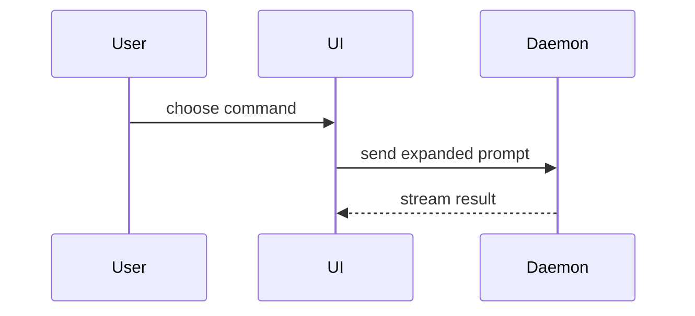

Help the user understand the current topic visually. Skip the preamble. Pick the smallest view that makes the key point clear.

Chat and CLI cannot render these views well. **Never paste mermaid, trees, diffs, pseudocode, or UI sketches into the transcript.** Write one unique markdown file, serve it, and keep chat to one or two sentences plus the URL.

## Render

Do not write to the skill directory, the repo, or any shared filename such as `out/content.md`. Concurrent agents will overwrite each other.

1. Create a unique inbox file, then write GitHub-flavored markdown to that exact path. Fenced ` ```mermaid ` blocks render as diagrams. Raw HTML is allowed when markdown is not enough.

```bash
mkdir -p "$HOME/.cache/show-me/inbox"
FILE="$(mktemp "$HOME/.cache/show-me/inbox/XXXXXX.md")"
echo "$FILE"
```

2. Serve and open that file. Set `SKILL_DIR` to the directory that contains
this `SKILL.md` (wherever the agent installed the skill — e.g.
`~/.codex/skills/show-me`, `~/.cursor/skills/show-me`):

```bash
bash "$SKILL_DIR/scripts/serve.sh" "$FILE"
```

The script copies the page into its own cache folder, starts `npx serve` if needed, and opens a unique URL. Wait for it to print the URL.
3. Reply with a short caption and the URL the script printed. No inline diagram.

## What to put in the markdown

Logic:

```text
on(save)
  if content is unchanged
    return cached result
  write new content
  return fresh result
```

Call tree:

```text
submitForm
  createSession
    persistPrompt
    launchAgent
  navigateToSession
```

Component tree, with state and module boundaries that matter:

```tsx
<SessionPage> (apps/example/src/routes/session.tsx)
  useSessionEvents()
  <SessionToolbar>
    <RunSkillButton> (packages/ui)
```

File tree:

```text
src/
├── commands/       # parses user actions
├── sessions/       # owns session state
└── transport/      # sends API requests
```

Mermaid for interaction, control flow, or data flow:



Diff when the point is what changes and the surrounding shape already exists.

```diff
 <SessionPage>
   useSessionEvents()
   <SessionToolbar>
+    <RunSkillButton />
   <SessionTimeline>
+    <SkillResultCard />
```

Show the whole block when most of it is new, when omitted context would hide ownership or order, or when the user needs a copyable target shape.

For a visual UI, layout, state comparison, or a concept too dense for mermaid, put HTML or SVG in the markdown. Real labels and data. Desktop and mobile.

## Guidance

Place each visual next to the short text it supports. Keep only the calls, files, props, states, and boundaries needed to answer the current question.

You may use one of these, you may use several, it is unlikely you will use all of them. Don't overwhelm the user.
